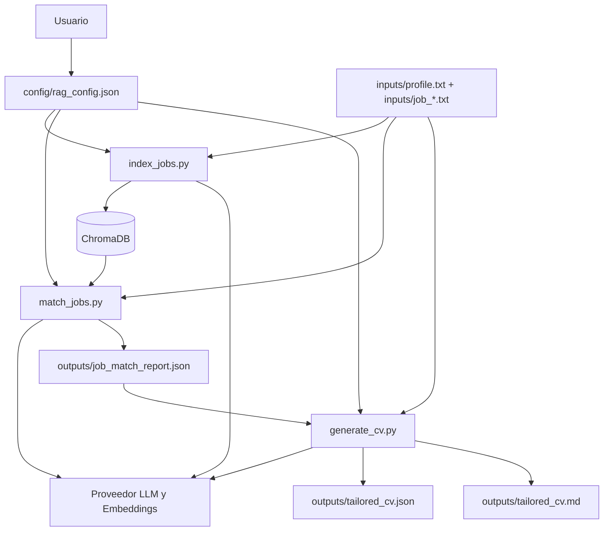

# RAG Matching de Empleos

Este proyecto toma un perfil en texto y varias descripciones de empleo (`.txt`) para:

1. Indexar jobs en ChromaDB.
2. Evaluar compatibilidad perfil vs jobs.
3. Generar un CV nuevo consolidado para esos requisitos.

El pipeline usa un proveedor de LLM/embeddings configurable en `rag.provider` (actualmente implementado: `ollama`).

## Arquitectura



## Flujo

1. `index_jobs.py` lee `inputs/job_*.txt`, divide en chunks y los indexa en Chroma.
2. `match_jobs.py` usa el perfil (`inputs/profile.txt`) y genera `outputs/job_match_report.json`.
3. `generate_cv.py` usa perfil + jobs + reporte de matching para crear:
- `outputs/tailored_cv.json`
- `outputs/tailored_cv.md`

## Estructura del codigo

Scripts centrales (raiz):

- `index_jobs.py`
- `match_jobs.py`
- `generate_cv.py`

Utilidades no centrales (`utils/`):

- `utils/rag_utils.py` (embeddings, Chroma, chunking, fallback de indexacion)
- `utils/common.py` (helpers de archivos/config)

## Requisitos

- Python 3.10+
- Proveedor LLM/embeddings disponible (local o remoto)
- Implementacion actual del proyecto: `ollama`
- Modelo de chat por defecto en Ollama: `llama3.2:3b-instruct-fp16`
- Modelo de embeddings por defecto en Ollama: `nomic-embed-text`

Instalacion:

```bash
pip install -r requirements.txt
```

## Configuracion

Archivo principal: `config/rag_config.json`

Campos importantes:

- `rag.provider`: proveedor de LLM/embeddings (actual: `ollama`)
- `rag.persist_directory`: ruta de base vectorial
- `match.profile_text_path`: perfil
- `match.job_text_glob`: jobs
- `match.output_path`: reporte de matching
- `cv.output_json_path`: salida estructurada de CV
- `cv.output_markdown_path`: CV final en Markdown

Ejemplo minimo (configuracion actual con `ollama`):

```json
{
  "rag": {
    "provider": "ollama",
    "persist_directory": "./chroma_url_db",
    "collection_name": "url_docs",
    "ollama_base_url": "http://localhost:11434",
    "ollama_chat_model": "llama3.2:3b-instruct-fp16",
    "ollama_embedding_model": "nomic-embed-text",
    "chunk_size": 1000,
    "chunk_overlap": 200
  },
  "match": {
    "profile_text_path": "./inputs/profile.txt",
    "job_text_glob": "./inputs/job_*.txt",
    "output_path": "./outputs/job_match_report.json",
    "prompt_template": "..."
  },
  "cv": {
    "output_json_path": "./outputs/tailored_cv.json",
    "output_markdown_path": "./outputs/tailored_cv.md"
  }
}
```

## Ejecucion

### 1) Local rapido (config principal)

```bash
python index_jobs.py --config config/rag_config.json
python match_jobs.py --config config/rag_config.json
python generate_cv.py --config config/rag_config.json
```

### 1.1) Probar Gemma 4 sin editar config

Si quieres evaluar otro LLM solo para esta corrida, usa overrides por CLI.
Ejemplo (ajusta el tag segun `ollama list`, por ejemplo `gemma4:latest`):

```bash
python index_jobs.py --config config/rag_config.json --embedding-model nomic-embed-text
python match_jobs.py --config config/rag_config.json --chat-model gemma4:latest
python generate_cv.py --config config/rag_config.json --chat-model gemma4:latest
```

Opcionalmente puedes apuntar a otra URL de Ollama sin cambiar JSON:

```bash
python match_jobs.py --config config/rag_config.json --chat-model gemma4:latest --ollama-base-url http://localhost:11434
```

### 2) Local con entorno virtual (PowerShell)

```powershell
.\.venv\Scripts\Activate.ps1
pip install -r requirements.txt
python index_jobs.py --config config/rag_config.json
python match_jobs.py --config config/rag_config.json
python generate_cv.py --config config/rag_config.json
```

### 3) Ejecucion por etapa

Solo indexar:

```bash
python index_jobs.py --config config/rag_config.json
```

Solo matching (requiere index previo):

```bash
python match_jobs.py --config config/rag_config.json
```

Solo generar CV (requiere perfil + jobs y opcionalmente reporte de matching):

```bash
python generate_cv.py --config config/rag_config.json
```

### 4) Local con config alternativa

Si quieres usar otra base vectorial o rutas de salida, crea una copia de config (por ejemplo `config/mi_config.json`) y ejecuta con `--config`:

```bash
python index_jobs.py --config config/mi_config.json
python match_jobs.py --config config/mi_config.json
python generate_cv.py --config config/mi_config.json
```

### 5) Docker

```bash
docker compose build
docker compose run --rm rag python index_jobs.py --config config/rag_config.json
docker compose run --rm rag python match_jobs.py --config config/rag_config.json
docker compose run --rm rag python generate_cv.py --config config/rag_config.json
```

### 6) Precondicion del proveedor LLM (ejemplo con Ollama)

Antes de ejecutar, verifica que tu proveedor este disponible. Ejemplo con Ollama:

```bash
ollama serve
ollama pull llama3.2:3b-instruct-fp16
ollama pull nomic-embed-text
ollama list
```

## Troubleshooting

### `Failed to connect to provider LLM` (ejemplo: Ollama)

- Si usas Ollama en host local: `http://localhost:11434`
- Si usas Ollama desde Docker: `http://host.docker.internal:11434`

### `PermissionError` o `disk I/O error` al indexar

`index_jobs.py` intenta resetear la base y, si falla por locks de Windows/OneDrive, usa una ruta fallback en `%TEMP%`.
Esa ruta fallback queda registrada y `match_jobs.py` / `generate_cv.py` la reutilizan automaticamente.

### El modelo devuelve formato invalido

- `match_jobs.py` repara JSON automaticamente.
- `generate_cv.py` usa salida etiquetada y fallback para no perder `tailored_cv.md` aunque el formato llegue imperfecto.
