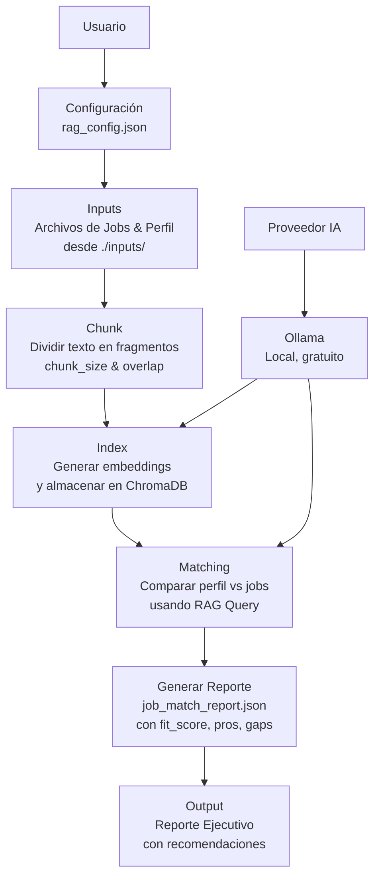

# RAG Matching de Empleos - Ollama

Este proyecto procesa archivos locales de perfiles y descripciones de trabajos para hacer matching usando **RAG** (retrieval + generación) con **Chroma**.

Soporta el proveedor:

- `ollama` (local, por defecto `http://localhost:11434`)

## Arquitectura



## Archivos Clave para Prompts y Configuración

- **`config/rag_config.json`**: Contiene el `prompt_template` principal para el matching de empleos (evalúa fit_score, pros, gaps, etc.).
- **`match_linkedin_jobs.py`**: Script que ejecuta el matching usando el prompt_template de la config.
- **`run_rag_pipeline.py`**: Permite preguntas ad-hoc con `--question` o modo chat con `--chat` (requiere adaptación para archivos locales).

## Requisitos

- Python 3.10+ (recomendado)
- Ollama instalado y corriendo

## Instalación (paquetes)

Instalá los paquetes necesarios (mínimo):

- `langchain`
- `langchain-community`
- `langchain-text-splitters`
- `langchain-chroma`
- `chromadb`
- `langchain-ollama`

Alternativa: podés usar Docker/Compose (ver sección "Docker").

## Configuración

El archivo `./config/rag_config.json` contiene defaults del proyecto. Podés cambiarlos allí o sobreescribir por CLI (flag `--config`).

Variables de entorno útiles:

- `RAG_PROVIDER`
- `RAG_PERSIST_DIRECTORY`
- `RAG_ARTIFACTS_DIR`
- `RAG_CHUNK_SIZE`
- `RAG_CHUNK_OVERLAP`
- `RAG_TOP_K`

## Flujo por etapas

El pipeline tiene 3 etapas:

1) `fetch`: descarga + limpia y guarda `documents.json`
2) `chunk`: genera `chunks.json`
3) `index`: genera embeddings y persiste en Chroma

Los artefactos quedan en `./rag_artifacts/url/`.

## Matching: perfil vs lista de jobs (LinkedIn)

Este repo incluye `match_linkedin_jobs.py`, que toma:

- un link de **perfil** (`match.profile_url`)
- una **lista de links** de jobs (`match.job_urls`)

y genera un reporte con compatibilidad (score + razones) en `match.output_path`.

Configuración (ver `./config/rag_config.json`):

- `match.profile_url`
- `match.job_urls` (lista)
- `match.output_path`
- `match.prompt_template` (el prompt que fuerza salida JSON)

Ejecutar en host:

```bash
python match_linkedin_jobs.py
```

Forzar re-descarga (ignorar cache en `rag_artifacts`):

```bash
python match_linkedin_jobs.py --refresh
```

### Ejemplo con Ollama (100% local)

Asegurate de tener modelos:

- Chat: `llama3.2:3b-instruct-fp16`
- Embeddings: `nomic-embed-text`

Etapas:

```bash
python "Guárdalo como rag_url_langchain.py" --provider ollama fetch --url "https://TU_URL"
python "Guárdalo como rag_url_langchain.py" --provider ollama chunk
python "Guárdalo como rag_url_langchain.py" --provider ollama --reset-db index --url "https://TU_URL"
python "Guárdalo como rag_url_langchain.py" --provider ollama ask --question "¿De qué trata la página?"
```

Modo chat:

```bash
python "Guárdalo como rag_url_langchain.py" --provider ollama chat
```

### Ejemplo con OpenAI

Configurar API key:

- PowerShell:

```powershell
$env:OPENAI_API_KEY="tu_api_key"
```

Ejecutar:

```bash
python "Guárdalo como rag_url_langchain.py" --provider openai index --url "https://TU_URL"
python "Guárdalo como rag_url_langchain.py" --provider openai ask --question "..."
```

## Notas

- Algunas páginas (LinkedIn, sitios con login/JS pesado) pueden no cargar bien con `WebBaseLoader`.
- Si re-indexás la misma URL varias veces sin resetear, podés introducir duplicados. Usá `--reset-db` cuando quieras recrear la base.

## Docker

Incluye:

- `Dockerfile`
- `docker-compose.yml`

El `docker-compose.yml` está configurado para usar Ollama del host en Windows vía:

- `http://host.docker.internal:11434`

Importante: si tu `rag_config.json` tiene `ollama_base_url` en `http://localhost:11434`, dentro del contenedor eso apunta al propio contenedor (y va a fallar). En Docker usá `host.docker.internal`.

Nota: por defecto los scripts leen `./config/rag_config.json`. Podés sobreescribir la ruta con `--config`.

### Ejecutar el pipeline en contenedor (runner)

Construir imagen:

```bash
docker compose build
```

Ejecutar pipeline completo (fetch -> chunk -> index) con pregunta final:

```bash
docker compose run --rm rag python run_rag_pipeline.py --ollama-base-url "http://host.docker.internal:11434" --url "https://TU_URL" --question "¿De qué trata la página?"
```

Ejecutar modo chat (después de indexar):

```bash
docker compose run --rm rag python run_rag_pipeline.py --ollama-base-url "http://host.docker.internal:11434" --url "https://TU_URL" --chat
```

### Ejecutar el CLI en contenedor

También podés ejecutar el CLI por etapas:

```bash
docker compose run --rm rag python "Guárdalo como rag_url_langchain.py" --ollama-base-url "http://host.docker.internal:11434" fetch --url "https://TU_URL"
docker compose run --rm rag python "Guárdalo como rag_url_langchain.py" chunk
docker compose run --rm rag python "Guárdalo como rag_url_langchain.py" --ollama-base-url "http://host.docker.internal:11434" --reset-db index --url "https://TU_URL"
docker compose run --rm rag python "Guárdalo como rag_url_langchain.py" ask --question "..."
```

### Ejecutar matching en contenedor

```bash
docker compose run --rm rag python match_linkedin_jobs.py
```

Con refresh:

```bash
docker compose run --rm rag python match_linkedin_jobs.py --refresh
```

## Troubleshooting

### Error: `Failed to connect to Ollama`

Si estás en Docker, no uses `localhost` para Ollama.

- Usá `--ollama-base-url "http://host.docker.internal:11434"` en el comando, o
- Editá `rag_config.json` y cambiá `ollama_base_url` a `http://host.docker.internal:11434`.

En host (sin Docker) sí corresponde `http://localhost:11434`.

### Error: `No module named 'bs4'`

`WebBaseLoader` necesita BeautifulSoup. Este repo incluye `beautifulsoup4` y `lxml` en `requirements.txt`. Si instalaste dependencias manualmente, reinstalá con:

```bash
pip install -r requirements.txt
```

### LinkedIn

LinkedIn puede devolver contenido incompleto o redirigir a login por anti-bot/JS.
Si no hay texto útil, la alternativa más estable es indexar desde:

- texto copiado de la descripción del job, o
- HTML guardado desde el navegador.

### Warnings de telemetry / onnxruntime

- Mensajes de telemetry de Chroma pueden aparecer como warnings y no siempre bloquean.
- Warnings de `onnxruntime` sobre GPU en Docker se pueden ignorar si el proceso continúa.
