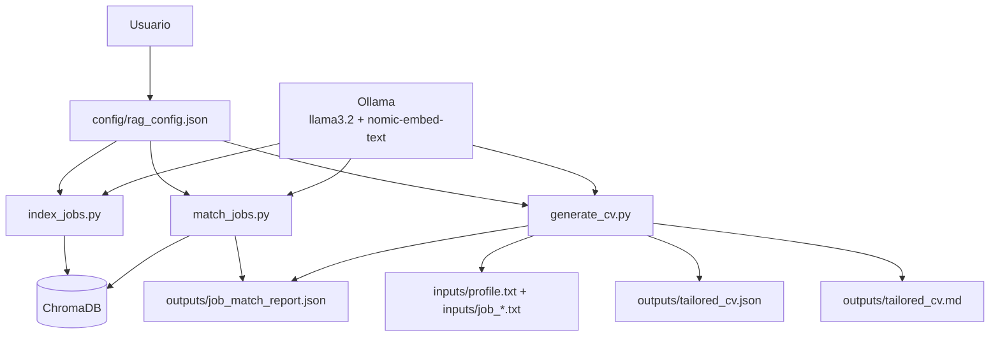

# RAG Matching de Empleos con Ollama

Este proyecto toma un perfil en texto y varias descripciones de empleo (`.txt`) para:

1. Indexar jobs en ChromaDB.
2. Evaluar compatibilidad perfil vs jobs.
3. Generar un CV nuevo consolidado para esos requisitos.

Todo corre en local con Ollama.

## Arquitectura



## Flujo

1. `index_jobs.py` lee `inputs/job_*.txt`, divide en chunks y los indexa en Chroma.
2. `match_jobs.py` usa el perfil (`inputs/profile.txt`) y genera `outputs/job_match_report.json`.
3. `generate_cv.py` usa perfil + jobs + reporte de matching para crear:
- `outputs/tailored_cv.json`
- `outputs/tailored_cv.md`

## Requisitos

- Python 3.10+
- Ollama corriendo localmente
- Modelos:
- `llama3.2:3b-instruct-fp16` (chat)
- `nomic-embed-text` (embeddings)

Instalacion:

```bash
pip install -r requirements.txt
```

## Configuracion

Archivo principal: `config/rag_config.json`

Campos importantes:

- `rag.persist_directory`: ruta de base vectorial
- `match.profile_text_path`: perfil
- `match.job_text_glob`: jobs
- `match.output_path`: reporte de matching
- `cv.output_json_path`: salida estructurada de CV
- `cv.output_markdown_path`: CV final en Markdown

Ejemplo minimo:

```json
{
  "rag": {
    "provider": "ollama",
    "persist_directory": "./chroma_url_db",
    "collection_name": "url_docs",
    "ollama_base_url": "http://localhost:11434",
    "ollama_chat_model": "llama3.2:3b-instruct-fp16",
    "ollama_embedding_model": "nomic-embed-text",
    "chunk_size": 1000,
    "chunk_overlap": 200
  },
  "match": {
    "profile_text_path": "./inputs/profile.txt",
    "job_text_glob": "./inputs/job_*.txt",
    "output_path": "./outputs/job_match_report.json",
    "prompt_template": "..."
  },
  "cv": {
    "output_json_path": "./outputs/tailored_cv.json",
    "output_markdown_path": "./outputs/tailored_cv.md"
  }
}
```

## Uso

```bash
python index_jobs.py --config config/rag_config.json
python match_jobs.py --config config/rag_config.json
python generate_cv.py --config config/rag_config.json
```

## Docker

```bash
docker compose build
docker compose run --rm rag python index_jobs.py --config config/rag_config.json
docker compose run --rm rag python match_jobs.py --config config/rag_config.json
docker compose run --rm rag python generate_cv.py --config config/rag_config.json
```

## Troubleshooting

### `Failed to connect to Ollama`

- Host local: `http://localhost:11434`
- Docker: `http://host.docker.internal:11434`

### `PermissionError` o `disk I/O error` al indexar

`index_jobs.py` intenta resetear la base y, si falla por locks de Windows/OneDrive, usa una ruta fallback en `%TEMP%`.

Si aparece warning de fallback, usa esa misma ruta para matching/CV actualizando `rag.persist_directory`.

### El modelo devuelve formato invalido

- `match_jobs.py` repara JSON automaticamente.
- `generate_cv.py` usa salida etiquetada y fallback para no perder `tailored_cv.md` aunque el formato llegue imperfecto.
