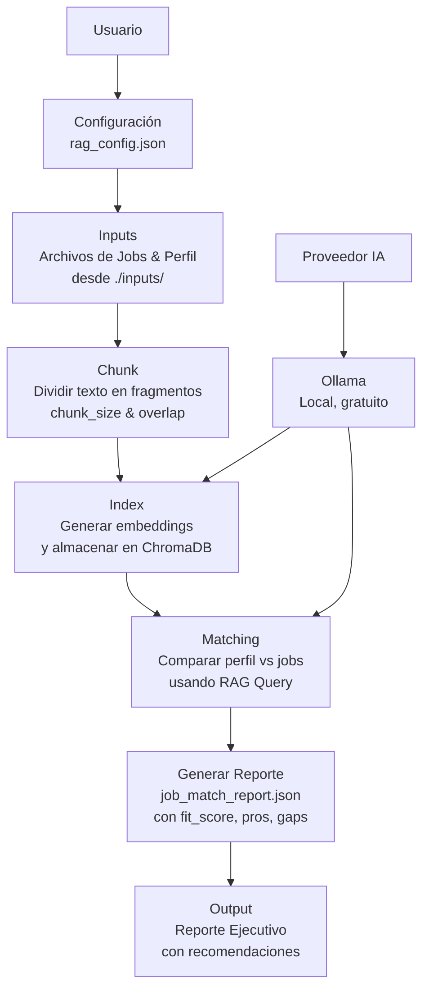

# Diagrama de Componentes del Proceso RAG para Matching de Empleos

```mermaid
flowchart TD
    A[Usuario] --> B[Configuración<br/>rag_config.json]
    B --> C[Inputs<br/>Archivos de Jobs & Perfil<br/>desde ./inputs/]
    
    C --> D[Chunk<br/>Dividir texto en fragmentos<br/>chunk_size & overlap]
    D --> E[Index<br/>Generar embeddings<br/>y almacenar en ChromaDB]
    
    E --> F[Matching<br/>Comparar perfil vs jobs<br/>usando RAG Query]
    F --> G[Generar Reporte<br/>job_match_report.json<br/>con fit_score, pros, gaps]
    
    H[Proveedor IA] --> I[Ollama<br/>Local, gratuito]
    
    I --> E
    I --> F
    
    G --> J[Output<br/>Reporte Ejecutivo<br/>con recomendaciones]
```